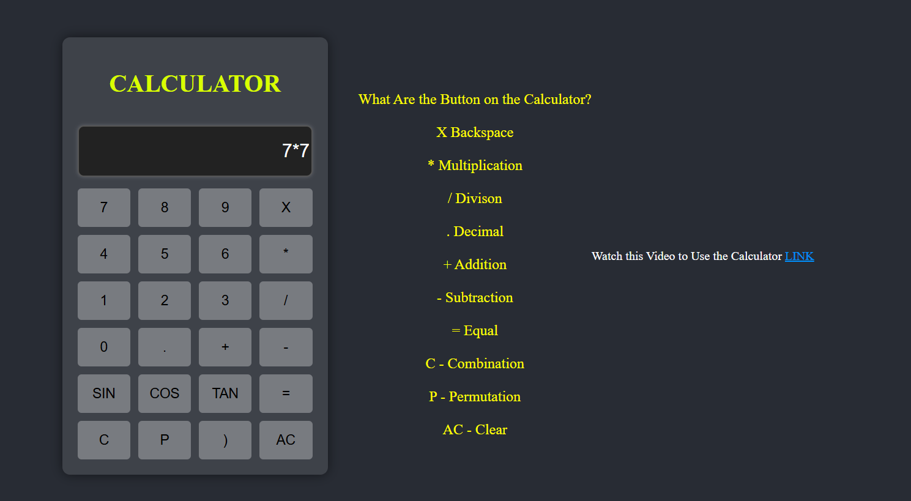
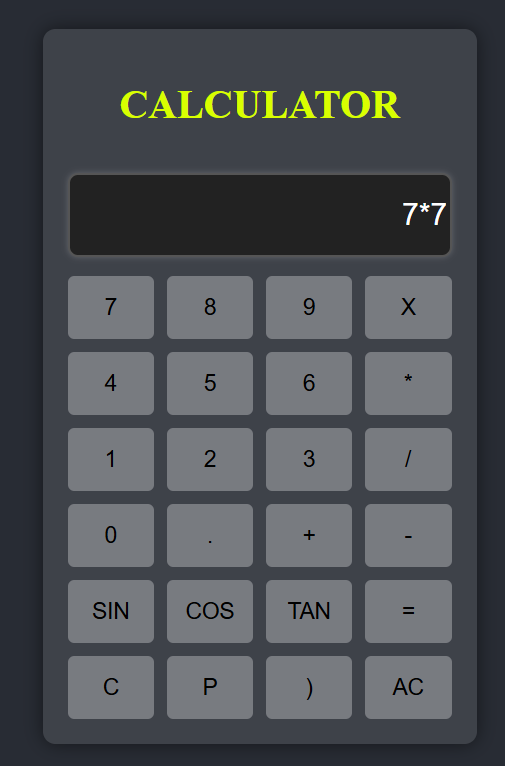
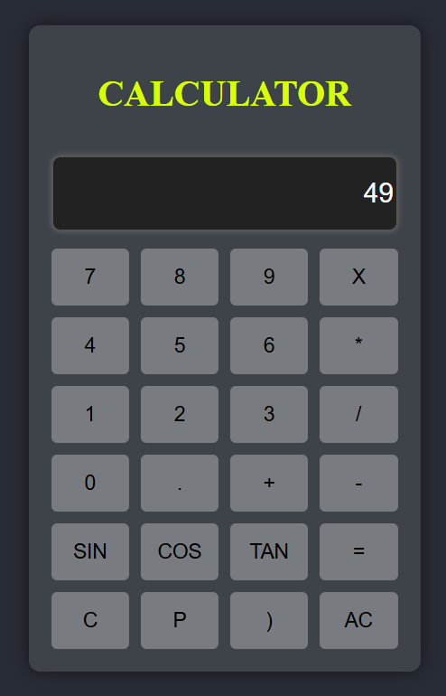
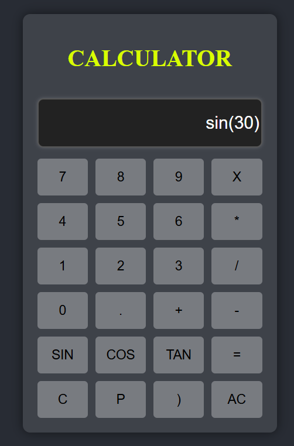
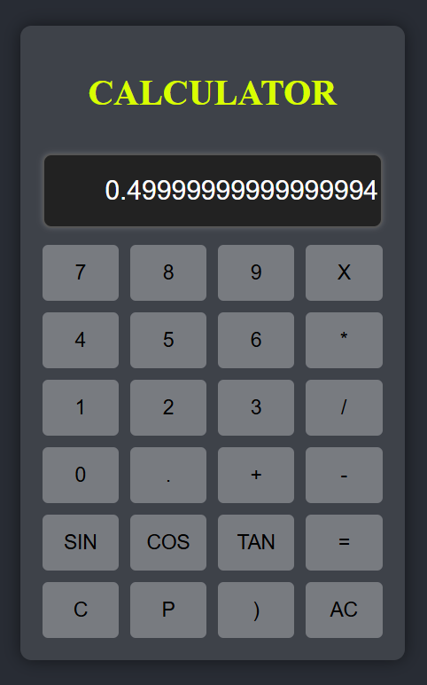
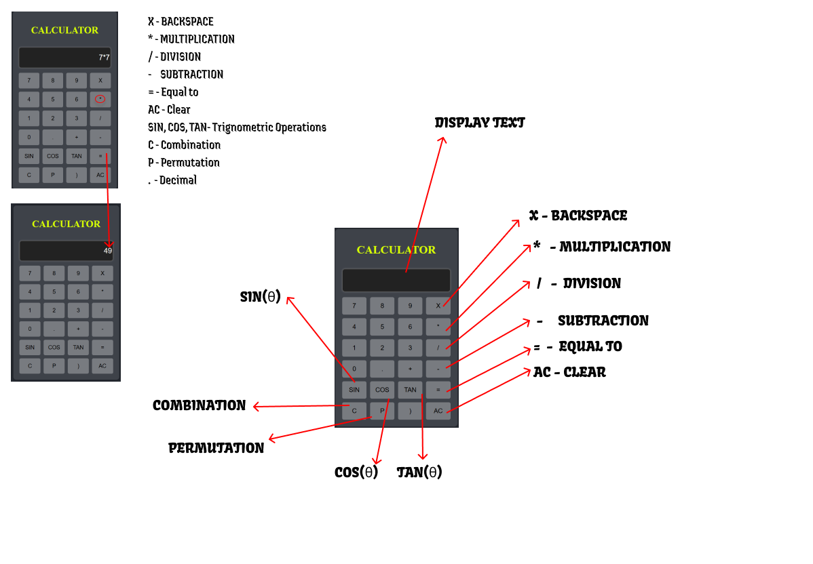

Calculator Project 🎯

## Basic Details
### Team Name: TechTrek

### Team Members
- Team Lead: Karthik Krishnan - SJCET Palai

### Project Description
This project is a multifunctional calculator capable of performing basic arithmetic operations, trigonometric calculations, square roots, permutations, and combinations. It's designed to be user-friendly and accessible for students and casual users alike.

### The Problem (that doesn't exist)
Students struggle with complex calculations and wish for a calculator that can do everything without needing to switch apps or devices. Who needs to calculate when they can just ask their friends?

### The Solution (that nobody asked for)
We created a calculator that not only performs basic math but also adds a bit of flair with functions like sine, cosine, tangent, and even square roots, all wrapped in a colorful interface that could distract you from your homework!

## Technical Details
### Technologies/Components Used
For Software:
Languages used: HTML, CSS, JavaScript
Frameworks used: None
Libraries used: None
Tools used: Text Editor (e.g., Visual Studio Code)

For Hardware:
Not applicable for this project.

### Implementation
For Software:

# Installation
Clone the repository: git clone <repository-url>
Open the index.html file in your web browser.
or  Click Here: https://iamkarthik2004.github.io/AdvancedCalculator/

📌📌📌 Note : If you using the calculator from Make it desktop mode and use it.

# Run
Simply open index.html in any modern web browser to use the calculator.

### Project Documentation
For Software:

# Screenshots (Add at least 3)

  

  

  

  

# Diagrams

For Hardware:

# Schematic & Circuit
(Not applicable for this project)

# Build Photos
Not applicable for this project.

### Project Demo
# Video
https://youtu.be/GQrvCsl_k6Y?si=051x7q88S6czxUCO

# Additional Demos

## Team Contributions
Karthik Krishnan: Project management, frontend development, and design.
